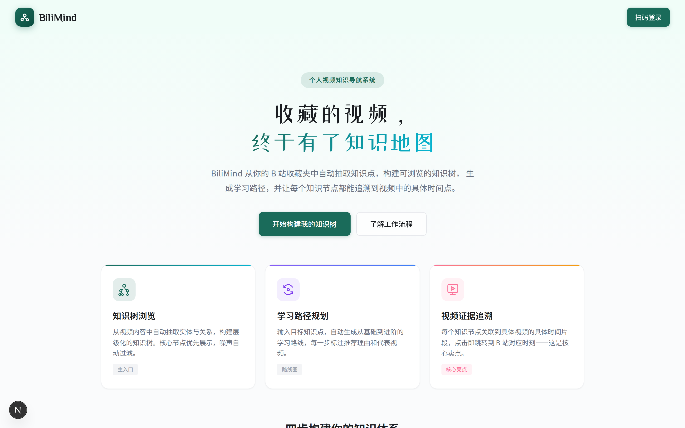
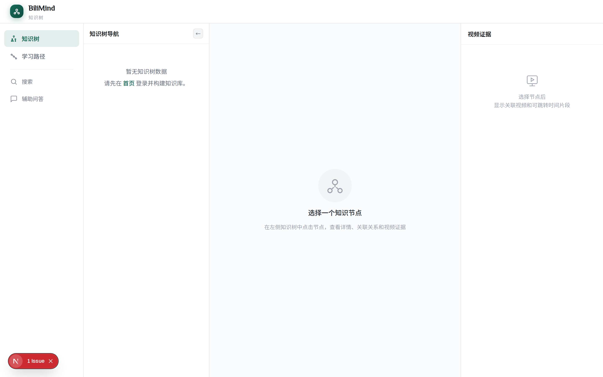
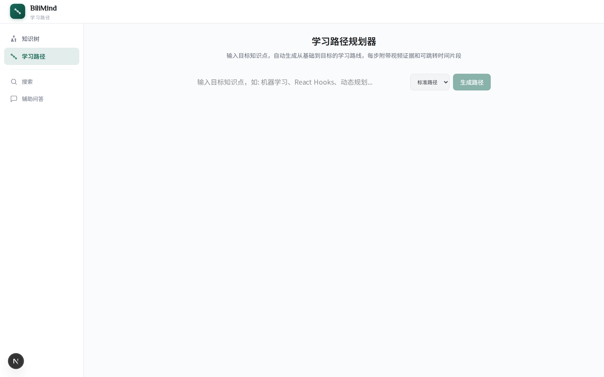
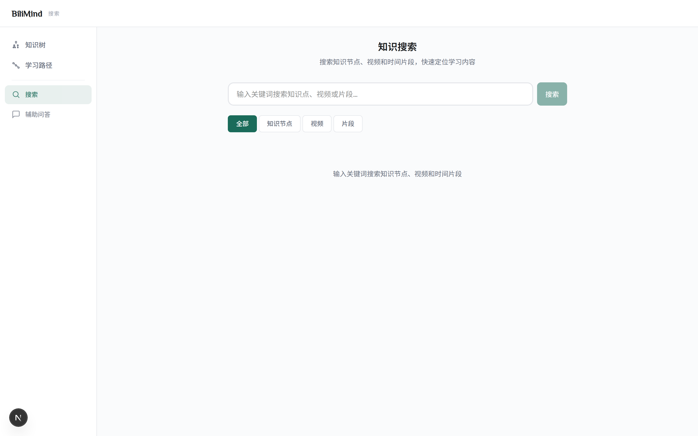

# BiliMind — 个人视频知识导航系统

将你的 B 站收藏视频自动转化为可浏览的知识树、可规划的学习路径、可追溯到原始视频时间点的知识证据系统。

> 不是聊天机器人，不是简单的视频搜索，而是一个面向个人收藏视频的**知识组织、学习导航与证据回溯系统**。



---

## 为什么做这个项目

很多人在 B 站收藏了大量学习视频——课程、讲座、技术分享——但收藏夹本身不提供任何知识组织能力。视频收藏得越多，越难回顾和系统学习。

BiliMind 解决的核心问题：

- **知识碎片化**：视频内容散落在不同收藏夹，缺乏结构化的知识组织
- **学习路径缺失**：不知道先看什么、后看什么，缺少从基础到进阶的导航
- **来源不可追溯**：记得某个概念来自某个视频，但无法快速定位到具体时间点

---

## 核心能力

1. **知识树浏览** — 从收藏视频中自动抽取知识实体和关系，构建层级化的知识树
2. **学习路径规划** — 输入目标知识点，自动生成从基础到目标的学习路线
3. **视频证据回溯** — 每个知识节点关联到具体视频的具体时间片段，点击即跳转到 B 站对应时刻
4. **节点质量分级** — 核心节点、普通节点、弱关联节点分层展示，噪声实体自动过滤
5. **知识搜索** — 跨知识节点、视频、时间片段的统一搜索

---

## 核心页面

### 知识树（主入口）

三栏布局：左侧知识树导航 + 中间知识节点工作台 + 右侧视频证据区

- 左栏：层级树结构，支持搜索、主题筛选、阶段过滤、难度筛选
- 中栏：节点定义、前置/后续知识、相关节点、学习动作入口
- 右栏：关联视频证据，每个时间片段均可一键跳转到 B 站对应位置



### 学习路径

输入目标知识点，选择模式（入门/标准/快速复习），自动生成学习路线图。
每一步展示推荐理由、关联视频、关键时间片段。



### 搜索

跨知识节点、视频、时间片段的统一搜索。
支持按类型、难度、置信度筛选，结果可直接跳转到知识树节点或 B 站视频。



---

## 系统架构

```
┌──────────┐     ┌──────────────┐     ┌───────────────┐
│  B站API  │────▶│  内容获取层   │────▶│  知识抽取引擎  │
│ (收藏夹)  │     │ 字幕/ASR/降级 │     │ LLM + 规则    │
└──────────┘     └──────────────┘     └───────┬───────┘
                                              │
                                              ▼
┌──────────┐     ┌──────────────┐     ┌───────────────┐
│  前端     │◀───│   API 层     │◀───│  知识图谱存储  │
│ Next.js   │     │  FastAPI     │     │ networkx+SQLite│
└──────────┘     └──────────────┘     └───────────────┘
                        │
                        ▼
                 ┌──────────────┐
                 │  向量检索层   │
                 │  ChromaDB    │
                 └──────────────┘
```

---

## 数据流

1. **同步收藏夹** — 通过 B 站扫码登录，拉取收藏夹视频列表
2. **内容获取** — 三级降级策略：官方字幕 → ASR 语音识别 → 基础信息
3. **文本切片** — 按时间窗口切分为带时间戳的片段
4. **知识抽取** — LLM 结构化抽取实体和关系，规则 fallback 兜底
5. **图谱构建** — 实体去重归一化，构建 networkx 有向图，持久化到 SQLite
6. **树投影** — 从图谱投影为前端展示的层级树，过滤噪声，质量分级
7. **向量入库** — 文本片段向量化存入 ChromaDB，支持语义检索

---

## 技术栈

| 层面 | 技术 |
|------|------|
| 后端 | Python, FastAPI, SQLAlchemy (async) |
| 知识图谱 | networkx + SQLite (WAL 模式) |
| 向量检索 | ChromaDB |
| LLM/ASR | DashScope (通义千问/Paraformer) |
| 前端 | Next.js 16, React 19, TypeScript, Tailwind CSS |
| 数据库 | SQLite (aiosqlite, WAL 并发安全) |

---

## 本地运行

### 前置条件

- Python 3.10+
- Node.js 18+
- ffmpeg（音频转写需要）

### 安装与启动

```bash
# 1. 克隆项目
git clone https://github.com/lux-liang/Bilimind.git
cd Bilimind

# 2. 安装后端依赖
pip install -r requirements.txt

# 3. 配置环境变量
cp .env.example .env
# 编辑 .env，填写 DashScope API Key

# 4. 启动后端
python -m uvicorn app.main:app --reload

# 5. 启动前端
cd frontend
npm install
npm run dev
```

后端 API 文档：`http://localhost:8000/docs`
前端页面：`http://localhost:3000`

---

## 环境变量

| 变量 | 说明 | 必填 |
|------|------|------|
| `DASHSCOPE_API_KEY` | DashScope API Key（LLM + ASR + Embedding） | 是 |
| `OPENAI_BASE_URL` | 兼容 OpenAI 的 API 地址 | 否 |
| `LLM_MODEL` | LLM 模型名 | 否 |
| `EMBEDDING_MODEL` | Embedding 模型名 | 否 |
| `DATABASE_URL` | 数据库连接串 | 否 |
| `TREE_MIN_CONFIDENCE` | 知识树节点最低置信度阈值 | 否 |
| `EXTRACTION_MIN_CONFIDENCE` | 知识抽取最低置信度 | 否 |

无 DashScope Key 时，系统仍可运行但知识抽取将降级为规则模式，辅助问答功能不可用。

---

## 知识库构建流程

1. 在首页扫码登录 B 站账号
2. 选择要构建的收藏夹
3. 系统自动拉取视频内容（字幕/ASR）
4. 对每个视频片段进行知识实体抽取
5. 构建知识图谱并投影为知识树
6. 在知识树页浏览、在学习路径页规划、在搜索页检索

---

## 页面说明

| 页面 | 路径 | 说明 |
|------|------|------|
| 首页 | `/` | 产品介绍与登录入口 |
| 知识树 | `/tree` | 主入口，三栏知识导航 |
| 学习路径 | `/learning-path` | 输入目标生成学习路线 |
| 搜索 | `/search` | 跨节点/视频/片段搜索 |
| 知识问答 | `/chat` | 基于知识树的辅助问答 |
| 节点详情 | `/node/[id]` | 知识节点完整信息 |
| 视频详情 | `/video/[bvid]` | 视频知识点时间线 |

---

## 常见问题

**Q：无 DashScope API Key 能用吗？**
A：可以启动，但知识抽取降级为规则模式（质量较低），辅助问答功能不可用。建议配置 Key 以获取最佳体验。

**Q：音频转写失败怎么办？**
A：确保本机已安装 ffmpeg 并加入 PATH。部分 B 站音频 URL 存在鉴权限制，系统会自动执行本地下载 + 转码的兜底流程。

**Q：知识树里有乱七八糟的节点？**
A：系统已内置噪声过滤（口语碎片、无意义短词、过于宽泛的实体），并按置信度分级（核心/普通/弱关联）。弱关联节点默认折叠。可在设置中调整 `TREE_MIN_CONFIDENCE` 提高过滤门槛。

**Q：database is locked 报错？**
A：系统使用 SQLite WAL 模式并配置了 30 秒 busy_timeout，正常使用不应出现此问题。如仍遇到，可能是其他进程占用数据库文件。

---

## 后续 Roadmap

- [ ] 知识树节点手动编辑与合并
- [ ] 知识图谱可视化（力导向图）
- [ ] 多用户独立知识空间
- [ ] 更多视频平台接入
- [ ] 知识导出（Markdown / Anki 卡片）
- [ ] 移动端适配优化

---

## Acknowledgements

BiliMind 在以下开源项目的基础上进行了进一步的演进和重构：

- **[bilibili-rag](https://github.com/via007/bilibili-rag)** by [@via007](https://github.com/via007) — 原始项目提供了 B 站收藏夹接入、ASR 转写和基础 RAG 问答能力。BiliMind 在此基础上增加了知识图谱引擎、知识树构建与投影、学习路径规划、节点质量治理、视频片段证据追溯等能力，并对前端进行了完整的产品形态重构。
## Star History

<a href="https://www.star-history.com/?repos=lux-liang%2FBilimind&type=date&logscale=&legend=top-left">
 <picture>
   <source media="(prefers-color-scheme: dark)" srcset="https://api.star-history.com/image?repos=lux-liang/Bilimind&type=date&theme=dark&logscale&legend=top-left" />
   <source media="(prefers-color-scheme: light)" srcset="https://api.star-history.com/image?repos=lux-liang/Bilimind&type=date&logscale&legend=top-left" />
   
 </picture>
</a>
---

## License

MIT
